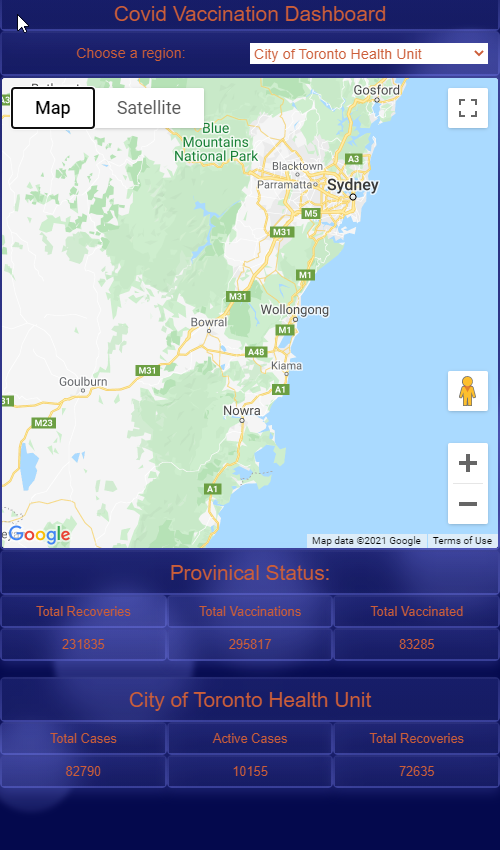

# Covid Dashboard Application

A dashboard geared towards showing positive progress in the fight against covid-19

## General Information
---
First group project. Group number 3 The Runtime Terrors. Due Sunday January 31st. 

## Deployed Link
---  
https://runtime-terrors-organization.github.io/covid-dashboard-application

## Screenshot
---

## Technologies / Libraries 
---
- HTML
- CSS
- JavaScript
- JQuery
- Tailwind CSS
- Moment.js
- Geocoding API
- Covid-19 tracker API

## Features
---
- Dashboard renders provincial covid-19 vaccination details
- Dropdown allows you to get more localized details based on regional health units
- Map moves with user to the selected health region

## Authors
---
- Allen Lovatt
- Andaleeb Farooq
- Nathan McCaw
- David Stapleton
- Jon Shallcross
